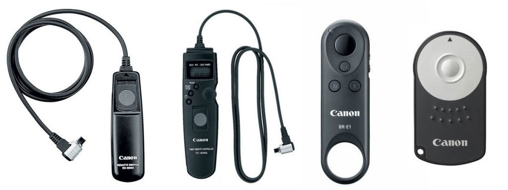

# cable_release_remote_control
This project aim is to create a device that can add remote control capacity to a camera cable release

# Introduction
*A description of cable release can be find here : https://lensnotes.com/photography/cable-release/*

A cable release, also known as a threaded cable release, is a device used to actuate the shutter of a camera without touching the shutter button. It consists of a flexible wire moving within a sheath, with a threaded connector on one end, an a plunger on the other.  
The cable release is a purely mechanical device, as opposed to an electronic remote shutter release.  

Self-timers have been produced in mid 1900's and can be used to actuate cable release. They can be used to add self-timer and long time exposure (1-10s) functions to mechanical cameras.  
  

When cameras mechanisms became electronic, and then fully digital, remote triggers have been created, adding a lot of new remote functions to trigger the camera. However, these triggers are usually connected to the camera through a proprietary digital connector.  
These electronic remote controls cannot be used with mechanical release threaded connector.

**This is the goal of this project : create a device that can add a remote control capacity to mechanical cameras.**

# Device Requirements and Architecture

As an engineer, it is a good habit to begin a project by defining all the requirements the resulting system shall satisfy.  
Because all the requirements have not the same weight (some of them are mandatory while some others are only wishes), it is also a good habit to give them a priority.  
During the design phase, in order to avoid the "tunnel effect" (a lot of work is done but there is still nothing usable), it is also a good habit to split requirements into several groups, each of the groups is an increment that defines a new release of the product.  
The first group defines what is usually called the Minimum Valuable Product (MVP). The MVP is the smallest product definition that leads to something that brings value to the user.  

At the same time the requirements are written, an architecture has to be defined. The architecture defines the main components of the product and how they interact. 
A good architecture leads to a good balance between the costs (components cost, but also development time and build time) and the added value for the customer.
The architecture design shall be able to meat requirements of the current definition of the product but shall also be able to support new requirements. 

Once the architecture has been defined, a cost (design, build) can be estimated for each requirement.  
The balance between estimated value and estimated cost can then be used to decide in which requirement group (which release) will be added a given requirement. In the case of a very bad balance, the decision can be made to reject the requirement.

